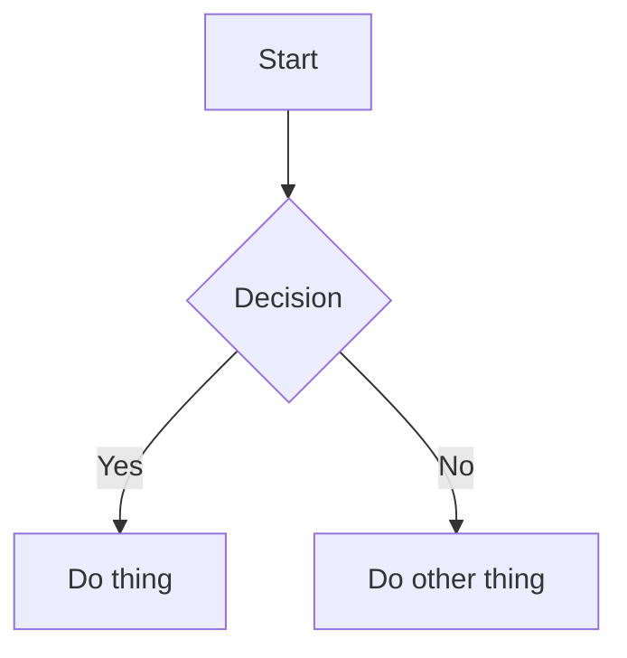
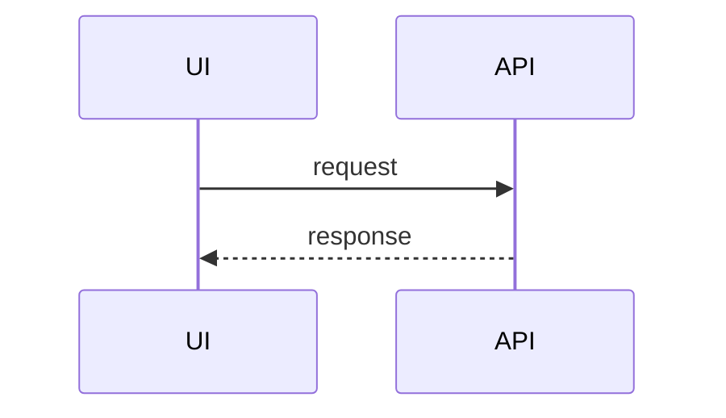
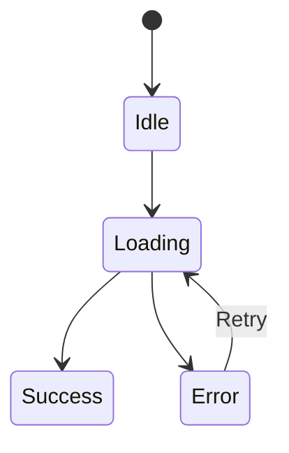

## Flow

```mermaid
flowchart TD
  A[Start] --> B{Decision}
  B -->|Yes| C[Do thing]
  B -->|No| D[Do other thing]
```

## Sequence

```mermaid
sequenceDiagram
  participant UI
  participant API
  UI->>API: request
  API-->>UI: response
```

## State

```mermaid
stateDiagram-v2
  [*] --> Idle
  Idle --> Loading
  Loading --> Success
  Loading --> Error
  Error --> Loading: Retry
```
