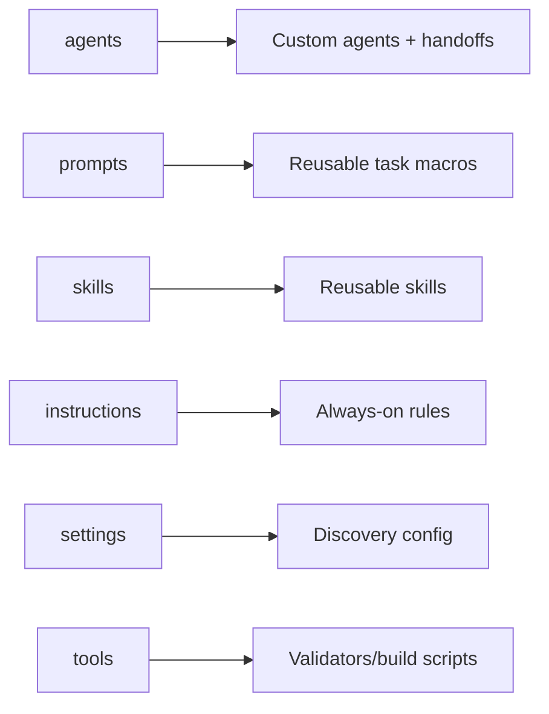

# Pack anatomy

```mermaid
flowchart LR
  A[agents] --> B[Custom agents + handoffs]
  P[prompts] --> Q[Reusable task macros]
  S[skills] --> T[Reusable skills]
  I[instructions] --> J[Always-on rules]
  V[settings] --> W[Discovery config]
  X[tools] --> Y[Validators/build scripts]
```
