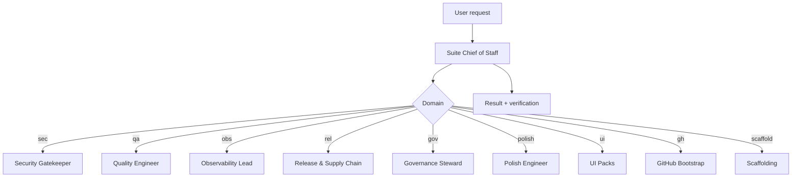

# Suite routing

```mermaid
flowchart TD
  U[User request] --> C[Suite Chief of Staff]
  C --> D{Domain}
  D -->|sec| SEC[Security Gatekeeper]
  D -->|qa| QA[Quality Engineer]
  D -->|obs| OBS[Observability Lead]
  D -->|rel| REL[Release & Supply Chain]
  D -->|gov| GOV[Governance Steward]
  D -->|polish| P[Polish Engineer]
  D -->|ui| UI[UI Packs]
  D -->|gh| GH[GitHub Bootstrap]
  D -->|scaffold| SC[Scaffolding]
  C --> R[Result + verification]
```
