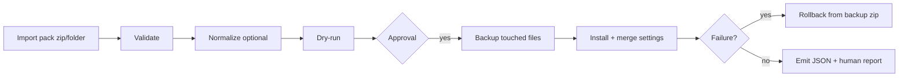

# Install Pipeline

```mermaid
flowchart LR
  A[Import pack zip/folder] --> B[Validate]
  B --> C[Normalize optional]
  C --> D[Dry-run]
  D --> E{Approval}
  E -- yes --> F[Backup touched files]
  F --> G[Install + merge settings]
  G --> H{Failure?}
  H -- yes --> I[Rollback from backup zip]
  H -- no --> J[Emit JSON + human report]
```
