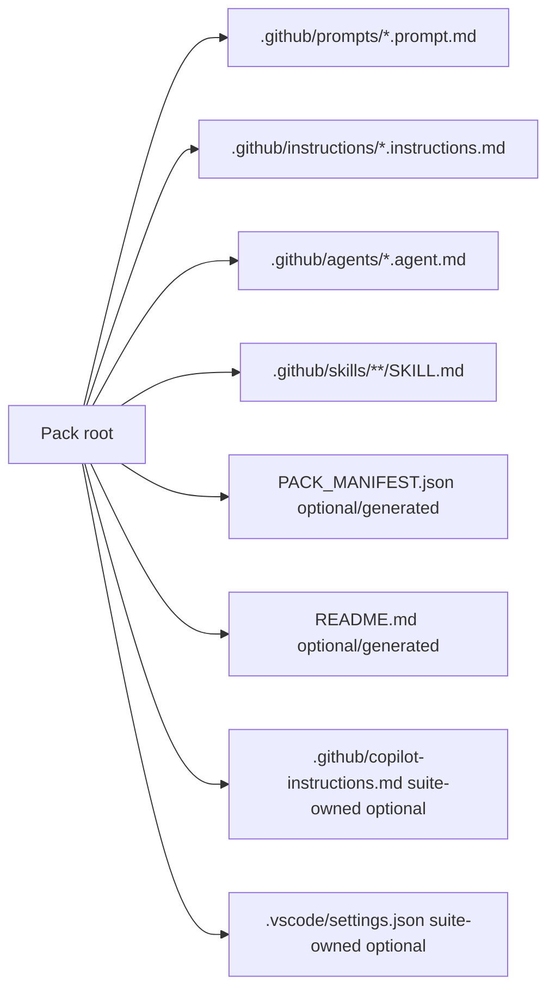

# Pack Anatomy

```mermaid
flowchart LR
  A[Pack root] --> B[.github/prompts/*.prompt.md]
  A --> C[.github/instructions/*.instructions.md]
  A --> D[.github/agents/*.agent.md]
  A --> E[.github/skills/**/SKILL.md]
  A --> F[PACK_MANIFEST.json optional/generated]
  A --> G[README.md optional/generated]
  A --> H[.github/copilot-instructions.md suite-owned optional]
  A --> I[.vscode/settings.json suite-owned optional]
```
