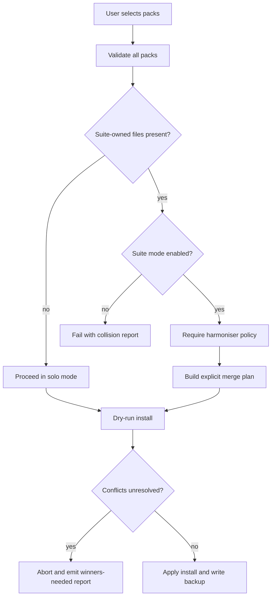

# Suite Routing Flow

```mermaid
flowchart TD
  A[User selects packs] --> B[Validate all packs]
  B --> C{Suite-owned files present?}
  C -- no --> D[Proceed in solo mode]
  C -- yes --> E{Suite mode enabled?}
  E -- no --> F[Fail with collision report]
  E -- yes --> G[Require harmoniser policy]
  G --> H[Build explicit merge plan]
  D --> I[Dry-run install]
  H --> I
  I --> J{Conflicts unresolved?}
  J -- yes --> K[Abort and emit winners-needed report]
  J -- no --> L[Apply install and write backup]
```
